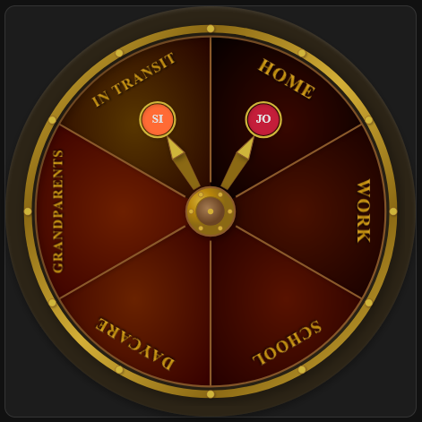

# Weasley Clock Card

A custom Lovelace card for Home Assistant that displays a magical Weasley Clock in steampunk style (more to be added later) - showing where your home assistant users are located.



## Features

- **Steampunk Design**: An initial design, more will be added later. Feel free to let me know your preferences
- **Person Tracking**: Displays person entities with their Home Assistant profile pictures or first two characters
- **Configurable Sections**: Up to 8 customizable sections (Home, Work, School, etc.)
- **Zone Mapping**: Multiple zones can map to a single section
- **Fan-out Support**: Multiple persons in the same section spread out to avoid overlap
- **Theme Support**: Adapts to Home Assistant light and dark themes

## Installation

### HACS (Recommended)

1. Open HACS in Home Assistant
2. Click on "Frontend"
3. Click the "+" button
4. Search for "Weasley Clock Card"
5. Install the card
6. Refresh your browser

### Manual Installation

1. Download `weasley-clock-card.js` from the [latest release](https://github.com/jochimsergoyne/weasley-clock/releases)
2. Copy it to your `config/www` folder
3. Add the resource in Home Assistant:
   - Go to Settings → Dashboards → Resources
   - Add `/local/weasley-clock-card.js` as a JavaScript Module

## Configuration

Add the card to your Lovelace dashboard:

```yaml
type: custom:weasley-clock-card
persons:
  - entity: person.harry
    name: Harry
    color: "#C41E3A"
  - entity: person.ron
    name: Ron
    color: "#FF6B35"
  - entity: person.hermione
    name: Hermione
    color: "#5D4E8C"
sections:
  - name: Home
    zones:
      - zone.home
  - name: Work
    zones:
      - zone.office_harry
      - zone.office_ron
      - zone.ministry
  - name: School
    zones:
      - zone.hogwarts
  - name: Garden
    zones:
      - zone.garden
  - name: Traveling
    zones: []
default_section: Traveling
```

### Configuration Options

| Option | Type | Required | Default | Description |
|--------|------|----------|---------|-------------|
| `type` | string | Yes | - | Must be `custom:weasley-clock-card` |
| `persons` | list | Yes | - | List of person entities to track |
| `sections` | list | Yes | - | List of clock sections (1-8 sections) |
| `default_section` | string | No | First section | Section name for persons in unmapped zones |

### Person Configuration

| Option | Type | Required | Description |
|--------|------|----------|-------------|
| `entity` | string | Yes | Person entity ID (e.g., `person.harry`) |
| `name` | string | No | Display name override |
| `color` | string | No | Fallback color if no profile picture (hex format) |

### Section Configuration

| Option | Type | Required | Description |
|--------|------|----------|-------------|
| `name` | string | Yes | Display name for the section |
| `zones` | list | Yes | List of zone entity IDs that map to this section |

## Examples

### Basic 4-Section Clock

```yaml
type: custom:weasley-clock-card
persons:
  - entity: person.mom
  - entity: person.dad
  - entity: person.kid
sections:
  - name: Home
    zones:
      - zone.home
  - name: Work
    zones:
      - zone.work
  - name: School
    zones:
      - zone.school
  - name: Away
    zones: []
default_section: Away
```

### Extended 8-Section Clock

```yaml
type: custom:weasley-clock-card
persons:
  - entity: person.arthur
    name: Arthur
  - entity: person.molly
    name: Molly
  - entity: person.bill
    name: Bill
  - entity: person.charlie
    name: Charlie
  - entity: person.percy
    name: Percy
  - entity: person.fred
    name: Fred
  - entity: person.george
    name: George
  - entity: person.ron
    name: Ron
  - entity: person.ginny
    name: Ginny
sections:
  - name: Home
    zones:
      - zone.home
      - zone.the_burrow
  - name: Work
    zones:
      - zone.ministry
      - zone.gringotts
  - name: School
    zones:
      - zone.hogwarts
  - name: Garden
    zones:
      - zone.garden
  - name: Hospital
    zones:
      - zone.st_mungos
  - name: Prison
    zones:
      - zone.azkaban
  - name: Mortal Peril
    zones: []
  - name: Traveling
    zones: []
default_section: Traveling
```

## Behavior Notes

- **Unavailable Persons**: When a person entity is unavailable or unknown, their clock hand is hidden
- **Unmapped Zones**: If a person is in a zone not mapped to any section, they appear in the `default_section`
- **Zone Matching**: Zones are matched by entity ID (e.g., `zone.home` matches the "home" state)
- **Multiple Persons**: When multiple persons are in the same section, their hands fan out evenly within that section

## Troubleshooting

### Clock hand not moving
- Verify the person entity is updating in Home Assistant
- Check that the zone entity IDs in your config match your actual zones
- Ensure the person's current zone is mapped to a section

### Person picture not showing
- Verify the person entity has an `entity_picture` attribute
- Check your Home Assistant user profile has a picture set
- The fallback will show colored initials if no picture is available

### Card not loading
- Clear your browser cache
- Check the browser console for errors
- Verify the resource is properly registered in Home Assistant

## Development

```bash
# Install dependencies
npm install

# Build the card
npm run build

# Watch for changes during development
npm run watch
```

## License

MIT License - See [LICENSE](LICENSE) for details.
