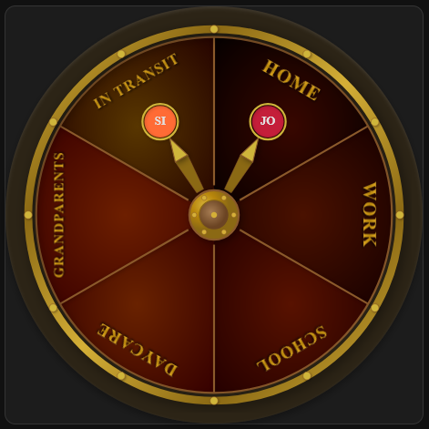
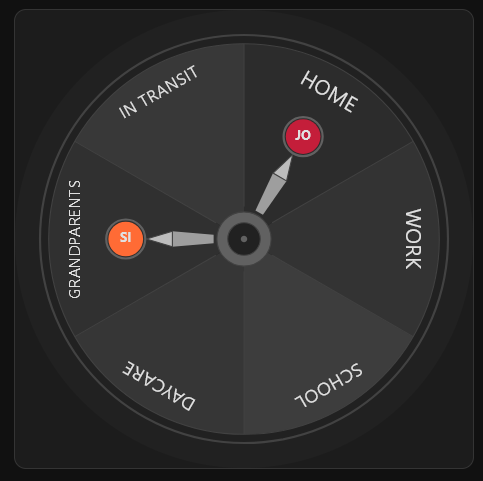
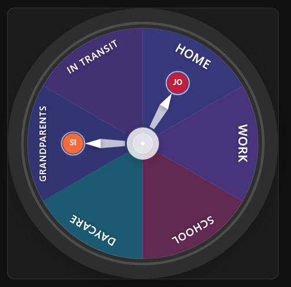
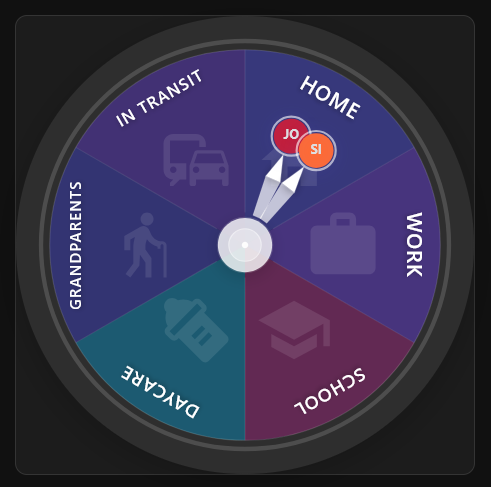

# Weasley Clock Card

A custom Lovelace card for Home Assistant that displays a magical Weasley Clock - showing where your family members are located. Choose from three beautiful themes: Steampunk (classic brass and gold), Minimalist (clean and modern), or Playful (vibrant gradients with glass effects).



## Features

- **Multiple Themes**: Choose from Steampunk, Minimalist, or Playful designs
- **Person Tracking**: Displays person entities with their Home Assistant profile pictures or first two characters
- **Configurable Sections**: Up to 8 customizable sections (Home, Work, School, etc.)
- **Section Icons**: Optional MDI icons displayed as watermarks within sections
- **Conditional Visibility**: Optionally hide the entire card unless someone is in one of the configured sections
- **Zone Mapping**: Multiple zones can map to a single section
- **Fan-out Support**: Multiple persons in the same section spread out to avoid overlap
- **Theme Support**: Adapts to Home Assistant light and dark modes
- **Tap Actions**: Configurable actions when tapping a person's clock hand (more-info, navigate, perform-action, etc.)
- **Visual Editor**: Configure theme, persons and sections from the dashboard UI, no YAML required

## Installation

### HACS (Recommended)

1. Open HACS in Home Assistant
2. Click on "Frontend"
3. Click the "+" button
4. Search for "Weasley Clock Card"
5. Install the card
6. Refresh your browser

### Manual Installation

1. Download `weasley-clock-card.js` from the [latest release](https://github.com/s5zone/weasley-clock-card/releases)
2. Copy it to your `config/www` folder
3. Add the resource in Home Assistant:
   - Go to Settings → Dashboards → Resources
   - Add `/local/weasley-clock-card.js` as a JavaScript Module

### Other themes
Minimalist:



Playful:



### Icons
Example with icons:



### Configuration

Add the card from the dashboard's card picker and configure it with the visual editor, or switch to the code editor and use YAML:

```yaml
type: custom:weasley-clock-card
persons:
  - entity: person.harry
    name: Harry
    color: "#C41E3A"
  - entity: person.ron
    name: Ron
    color: "#FF6B35"
  - entity: person.hermione
    name: Hermione
    color: "#5D4E8C"
sections:
  - name: Home
    icon: "mdi:home"
    zones:
      - zone.home
  - name: Work
    icon: "mdi:briefcase"
    zones:
      - zone.office_harry
      - zone.office_ron
      - zone.ministry
  - name: School
    icon: "mdi:school"
    zones:
      - zone.hogwarts
  - name: Garden
    icon: "mdi:flower"
    zones:
      - zone.garden
  - name: Traveling
    icon: "mdi:car"
    zones: []
default_section: Traveling
```

### Visual Editor

The card can be fully configured from the dashboard UI:

- **General**: theme, default section and conditional visibility (`visible_when_in`)
- **Persons**: add, remove and reorder persons; pick the person entity and set a name, fallback color and tap action
- **Sections**: add (up to 8), remove and reorder sections; set a name, icon and the zones that map to it

Renaming or removing a section automatically updates `default_section` and `visible_when_in`.

### Configuration Options

| Option | Type | Required | Default | Description |
|--------|------|----------|---------|-------------|
| `type` | string | Yes | - | Must be `custom:weasley-clock-card` |
| `theme` | string | No | `steampunk` | Clock theme: `steampunk`, `minimalist`, or `playful` |
| `persons` | list | Yes | - | List of person entities to track |
| `sections` | list | Yes | - | List of clock sections (1-8 sections) |
| `default_section` | string | No | First section | Section name for persons in unmapped zones |
| `visible_when_in` | list | No | - | List of section names. If set, the card is only shown when at least one tracked person is currently in one of these sections. Omit (or leave empty) to always show. |

### Person Configuration

| Option | Type | Required | Description |
|--------|------|----------|-------------|
| `entity` | string | Yes | Person entity ID (e.g., `person.harry`) |
| `name` | string | No | Display name override |
| `color` | string | No | Fallback color if no profile picture (hex format) |
| `tap_action` | object | No | Action to perform when tapping the person's clock hand |

### Tap Action Configuration

| Option | Type | Required | Description |
|--------|------|----------|-------------|
| `action` | string | Yes | Action type: `more-info`, `toggle`, `perform-action`, `call-service`, `navigate`, `url`, or `none` |
| `entity` | string | No | Entity ID for `more-info` or `toggle` actions (defaults to the person entity) |
| `navigation_path` | string | No | Path for `navigate` action (e.g., `/lovelace/person`) |
| `url_path` | string | No | URL for `url` action |
| `perform_action` | string | No | Action to perform for `perform-action` (e.g., `notify.mobile_app`) |
| `data` | object | No | Data to pass to the `perform-action` action |
| `target` | object | No | Target (e.g., `entity_id`) for the `perform-action` action |
| `service` | string | No | Service to call for the legacy `call-service` action (e.g., `notify.mobile_app`) |
| `service_data` | object | No | Data to pass to the legacy `call-service` action |

### Section Configuration

| Option | Type | Required | Description |
|--------|------|----------|-------------|
| `name` | string | Yes | Display name for the section |
| `zones` | list | Yes | List of zone entity IDs that map to this section |
| `icon` | string | No | MDI icon to display as a watermark in the section (e.g., `mdi:home`) |

### Available Themes

| Theme | Description |
|-------|-------------|
| `steampunk` | Classic brass and gold Victorian-era design with decorative rivets, metallic gradients, and an aged parchment look. Uses the Cinzel serif font for labels. |
| `minimalist` | Clean, flat design with a monochrome gray palette. No shadows or decorative elements. Simple thin borders and modern sans-serif typography. |
| `playful` | Vibrant gradient design with glass-morphism effects. Features colorful sections (purples, blues, pinks, teals), soft glowing accents, and a fun, whimsical feel. |

All themes automatically adapt to Home Assistant's light and dark modes.

## Examples

### Minimalist Theme

```yaml
type: custom:weasley-clock-card
theme: minimalist
persons:
  - entity: person.mom
  - entity: person.dad
  - entity: person.kid
sections:
  - name: Home
    zones:
      - zone.home
  - name: Work
    zones:
      - zone.work
  - name: School
    zones:
      - zone.school
  - name: Away
    zones: []
default_section: Away
```

### Playful Theme

```yaml
type: custom:weasley-clock-card
theme: playful
persons:
  - entity: person.mom
  - entity: person.dad
  - entity: person.kid
sections:
  - name: Home
    zones:
      - zone.home
  - name: Work
    zones:
      - zone.work
  - name: School
    zones:
      - zone.school
  - name: Away
    zones: []
default_section: Away
```

### Steampunk Theme (Default)

```yaml
type: custom:weasley-clock-card
theme: steampunk
persons:
  - entity: person.mom
  - entity: person.dad
  - entity: person.kid
sections:
  - name: Home
    zones:
      - zone.home
  - name: Work
    zones:
      - zone.work
  - name: School
    zones:
      - zone.school
  - name: Away
    zones: []
default_section: Away
```

### Extended 8-Section Clock

```yaml
type: custom:weasley-clock-card
persons:
  - entity: person.arthur
    name: Arthur
  - entity: person.molly
    name: Molly
  - entity: person.bill
    name: Bill
  - entity: person.charlie
    name: Charlie
  - entity: person.percy
    name: Percy
  - entity: person.fred
    name: Fred
  - entity: person.george
    name: George
  - entity: person.ron
    name: Ron
  - entity: person.ginny
    name: Ginny
sections:
  - name: Home
    zones:
      - zone.home
      - zone.the_burrow
  - name: Work
    zones:
      - zone.ministry
      - zone.gringotts
  - name: School
    zones:
      - zone.hogwarts
  - name: Garden
    zones:
      - zone.garden
  - name: Hospital
    zones:
      - zone.st_mungos
  - name: Prison
    zones:
      - zone.azkaban
  - name: Mortal Peril
    zones: []
  - name: Traveling
    zones: []
default_section: Traveling
```

### Conditional Visibility

Hide the card whenever everyone is home; show it as soon as someone is at work, at school, or travelling:

```yaml
type: custom:weasley-clock-card
visible_when_in:
  - Work
  - School
  - Traveling
persons:
  - entity: person.mom
  - entity: person.dad
  - entity: person.kid
sections:
  - name: Home
    zones:
      - zone.home
  - name: Work
    zones:
      - zone.work
  - name: School
    zones:
      - zone.school
  - name: Traveling
    zones: []
default_section: Traveling
```

### Using Tap Actions

```yaml
type: custom:weasley-clock-card
persons:
  - entity: person.harry
    name: Harry
    tap_action:
      action: more-info
  - entity: person.ron
    name: Ron
    tap_action:
      action: navigate
      navigation_path: /lovelace/ron-dashboard
  - entity: person.hermione
    name: Hermione
    tap_action:
      action: perform-action
      perform_action: notify.mobile_app_hermione
      data:
        message: "Hermione was tapped on the clock!"
sections:
  - name: Home
    zones:
      - zone.home
  - name: Away
    zones: []
default_section: Away
```

## Behavior Notes

- **Unavailable Persons**: When a person entity is unavailable or unknown, their clock hand is hidden
- **Unmapped Zones**: If a person is in a zone not mapped to any section, they appear in the `default_section`
- **Zone Matching**: Zones are matched by entity ID (e.g., `zone.home` matches the "home" state)
- **Multiple Persons**: When multiple persons are in the same section, their hands fan out evenly within that section
- **Conditional Visibility**: When `visible_when_in` is set, the card is fully hidden (takes no layout space) until at least one available person is in one of the listed sections. Persons whose state is `unavailable` or `unknown` do not count.

## Troubleshooting

### Clock hand not moving
- Verify the person entity is updating in Home Assistant
- Check that the zone entity IDs in your config match your actual zones
- Ensure the person's current zone is mapped to a section

### Person picture not showing
- Verify the person entity has an `entity_picture` attribute
- Check your Home Assistant user profile has a picture set
- The fallback will show colored initials if no picture is available

### Card not loading
- Clear your browser cache
- Check the browser console for errors
- Verify the resource is properly registered in Home Assistant

## Development

```bash
# Install dependencies
npm install

# Build the card
npm run build

# Watch for changes during development
npm run watch
```

# Developed by me with assistance from AI

I'm a senior software engineer with over 15 years of experience. Design and architecture are carefully planned, code is partially written by AI and reviewed by me.

[](https://claude.com/claude-code)

## License

MIT License - See [LICENSE](LICENSE) for details.
